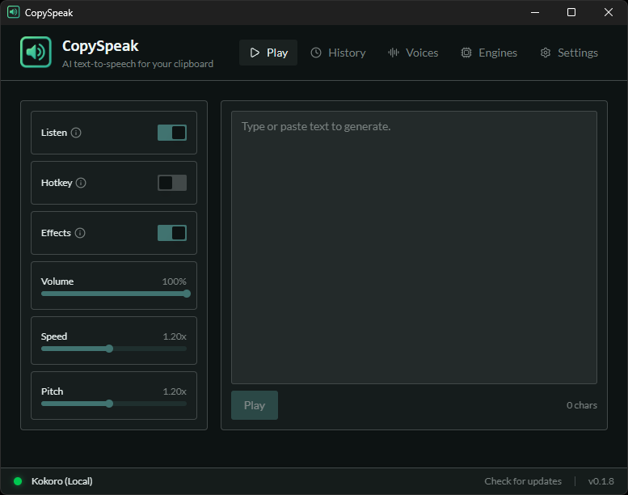

# CopySpeak

**Current Version:** 0.1.10

A modern Windows desktop app that reads clipboard text aloud using AI Text-to-Speech engines. Trigger speech by quickly copying the same text twice in a row.

## [Download Latest](https://github.com/ilyaizen/CopySpeak/releases)



## Quick Start

```bash
bun install
bun run tauri dev
```

## Features

### Core

- **Multiple trigger modes**: Double-copy (1.5s window), hotkey, or manual paste/play
- **11 TTS engines** across cloud and local:
  - **Cloud**: Edge-TTS (free), OpenAI (11 voices), ElevenLabs (voice library + cloning), Cartesia (low-latency streaming), Google Gemini TTS, Microsoft / Azure AI
  - **Local** (installed via `uv` into `%LOCALAPPDATA%\CopySpeak\engines\<engine>`): Kitten TTS (8 voices, CPU ONNX), Piper (20+ EN US voices, persistent RAM caching, optional CUDA GPU), Kokoro TTS (~11 voices), Pocket TTS (8+ voices), Chatterbox (zero-shot + emotion)
- **Voice profiles** — Create, edit, and switch between named voice profiles bundling engine, voice, speed, pitch, effects, and per-engine knobs as one swappable unit
- **Persistent RAM caching** — Local engines keep models loaded between utterances via a persistent HTTP server for sub-second synthesis
- **HUD overlay** — Floating heads-up display with real-time waveform visualization
- **History** — Persistent TTS generation history with playback and batch management
- **Voice profiles** — Create, edit, and switch between named voice profiles with engine, voice, speed, pitch, and effects settings
- **Audio effects** — Walkie-talkie, 8-bit Game Boy, and more via OfflineAudioContext post-processing
- **LLM post-processing** — Optional Groq/AI rewrite pass that turns copied text into concise, listener-friendly speech
- **Engines page** — Dedicated per-engine setup with API key entry, local-engine installers, and test buttons

### Settings

- General: auto-start, debug mode, language
- Playback: speed (0.25x–4x), pitch (0.5x–2x), volume
- Effects: toggle and select audio effects
- Triggers: double-copy window, hotkey configuration
- Sanitization: granular markdown stripping toggles, text normalization
- Advanced: LLM post-processing, engine catalog
- Audio: output device selection, format conversion (MP3/OGG/FLAC)

### System

- **System tray** — Quick access controls
- **Auto-updater** — Check and install updates from GitHub Releases
- **Control server** — Local HTTP server for external integrations (Pi, Claude Code, curl)
- **Pi & Claude Code extensions** — Speak AI assistant responses through CopySpeak
- **Audio save mode** — Save TTS output to files
- **Dark/Light mode** — Brutalist design with theme support

## Tech Stack

| Component       | Technology                                       |
| --------------- | ------------------------------------------------ |
| Backend         | Rust (Tauri v2)                                  |
| Frontend        | Svelte 5, TypeScript, Vite 8, Vitest 4 (happy-dom) |
| Package Manager | Bun                                              |
| Audio           | rodio                                            |
| UI              | shadcn-svelte, Tailwind CSS v4, mode-watcher     |

## Project Structure

```
src/                     # Svelte 5 frontend
├── lib/
│   ├── components/      # UI components
│   │   ├── effects-page.svelte
│   │   ├── engine/      # Engine settings
│   │   ├── history/     # History components
│   │   ├── hud/         # HUD overlay
│   │   ├── landing/     # Marketing landing page
│   │   ├── settings/    # Settings tabs
│   │   ├── ui/          # shadcn-svelte
│   │   ├── profiles-page.svelte
│   │   ├── play-page.svelte
│   │   └── ...
│   └── utils.ts         # Utilities (cn, portal action)
└── routes/              # SvelteKit routes
    ├── settings/        # Settings page
    ├── effects/         # Effects page
    ├── engine/          # Engine page
    ├── history/         # History page
    ├── profiles/        # Profiles page
    ├── onboarding/      # First-run setup
    └── hud/             # HUD overlay

src-tauri/src/           # Rust backend
├── main.rs              # Entry point, IPC registration
├── config/              # Persistence modules
│   └── tts.rs           # TTS config types, engine enum, VoiceProfile
├── commands/            # IPC handlers
│   └── tts/             # Synthesis, profiles, voices, health, credentials
├── tts/                 # TTS backend implementations
│   ├── edge.rs          # Edge TTS
│   ├── openai.rs        # OpenAI
│   ├── elevenlabs.rs    # ElevenLabs
│   ├── cartesia.rs      # Cartesia
│   ├── google.rs        # Google Gemini TTS
│   ├── microsoft.rs     # Microsoft AI / Azure
│   ├── http.rs          # Generic HTTP
│   ├── cli.rs           # Local CLI engines (Kokoro, Kitten, Pocket, Piper)
│   ├── local_tts_server.rs  # Persistent local HTTP server
│   ├── piper_server.rs  # Piper persistent server (CUDA GPU mode)
│   └── catalog.rs       # Engine catalog types
├── clipboard.rs         # Double-copy detection
├── audio/               # Playback (player, format, wav)
├── post_process/        # LLM post-processing
├── control_server.rs    # Local HTTP control server (Pi / Claude Code)
└── sanitize/            # Text normalization
```

## Commands

> **Tip — RTK (Rust Token Killer)**: Install this tool to get compact, token-efficient output for Cargo/Git/test commands (especially useful for AI coding agents). This installs the latest `dev-*` pre-release (rc) tag:
> ```powershell
> $tag=(git ls-remote --tags https://github.com/rtk-ai/rtk|Select-String 'refs/tags/dev-'|ForEach-Object{($_-split 'refs/tags/')[1].Trim()-replace '\^\{\}$',''}|Sort-Object{if($_-match 'dev-(\d+)\.(\d+)\.(\d+)-rc\.(\d+)'){[version]"$($matches[1]).$($matches[2]).$($matches[3])";[int]$matches[4]}}|Select-Object -Last 1);cargo install --git https://github.com/rtk-ai/rtk --tag $tag --force
> ```
> Then prefix commands with `rtk` (e.g. `rtk cargo test`, `rtk git log`).

```bash
# Development
bun run tauri dev           # Full app with hot-reload
bun run dev                 # Frontend only (port 5173)

# Build
bun run tauri build --bundles nsis   # Production build (NSIS installer)

bun run check                        # TypeScript/Svelte type checking
bun run check:watch                  # Watch mode for type checking

# Testing (Frontend — runs in the happy-dom environment)
bun run test                         # Run all frontend tests (vitest)
bun run test <name>                  # Run single frontend test
bun run test:watch                   # Watch mode

# Testing (Rust)
cd src-tauri && cargo test             # Run all Rust tests
cd src-tauri && cargo test <name>      # Run single Rust test
cd src-tauri && cargo check            # Type check Rust
cd src-tauri && cargo clippy           # Lint Rust

# Formatting
  bun format                   # Prettier format (`prettier --write .`)

# Version Bumping
bun run bump                # Patch version bump (0.0.x)
bun run bump:minor          # Minor version bump (0.x.0)
bun run bump:major          # Major version bump (x.0.0)
```

## Changelog

See [CHANGELOG.md](./CHANGELOG.md) for recent changes.

## Contributing

We welcome contributions! Please see our [Contributing Guide](./docs/CONTRIBUTING.md) for details on how to get started, code style guidelines, and how to submit pull requests.

## License

MIT
